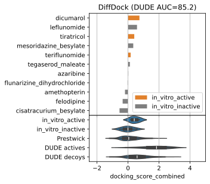

# DHODH virtual screen
Virtual screening of DHODH inhibitors reported in Schuhknecht et al., A human metabolic map of pharmacological perturbations unlocks new modes of action for conventional drugs.

 

The main summary plot (above) can be re-produced by running [summary_figure_plot.ipynb](workflow/notebooks/summary_figure_plot.ipynb) under [workflow/notebooks/](workflow/notebooks/). The directory contains additional notebooks used to prepare the data for docking, and process the raw results. The docking pipeline can be found under [workflow/Snakefile](workflow/Snakefile).